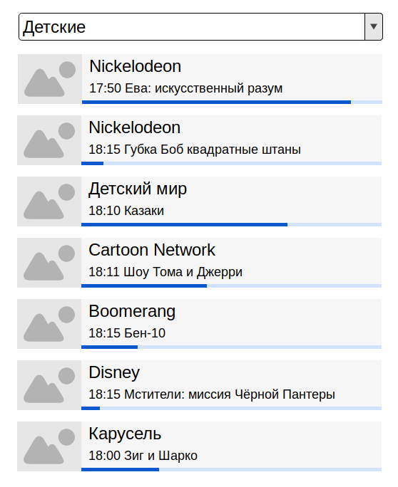

Тестовое задание для frontend-разработчика
---

Вашему вниманию представляется тествое задание для кандидата на должность frontend-разработчика.

В процессе решения задачи Вам предстоит создать web-приложения. Вы можете использовать любой фреймворк на ваше усмотрение
или чистый JS. Мы не накладываем ограничений на поддержку браузеров, вы можете смело игнорировать IE7 и любой другой браузер,
поддержка которого сильно усложняет жизнь.

Вы можете отправить нам ссылку на ваш репозиторий с решением или отправить нам архив с кодом.
Будет очень хорошо, если кроме кода вы напишете небольшую пояснительную записку о том, как вы решали задачу,
вы можете рассказать:

  1. Как вы восприняли формулировку задачи, возможно вы увидели в ней какие-то изъяны, неполноту и т.д.;
  1. Как вы подошли к планированию решения задачи;
  1. Какие трудности у вас возникли по ходу выполнения задачи;
  1. Какими недостатками и какими достоинствами обладает ваше решение;
  1. Что можно сделать, чтобы улучшить ваше решение.

Наши контакты: [personal@itmh.ru](mailto:personal@itmh.ru), 8-800-755-7000

Наши вакансии: [job.itmh.ru](https://job.itmh.ru/#work)

# Задача

Есть некоторое количество телеканалов.
Телеканалы разбиты на группы так, что каждый телеканал состоит минимум в одной группе.
У телеканалов есть программа телепередач, причем, для каждого канала можно узнать две передачи - текущую и следующую.
Необходимо сделать приложение, которое бы показывало список телеканалов, входящих в выбранную группу.
Для выбора группы телеканалов можно использовать элемент управления на подобии select или списка тэгов.
Каждый телеканал должен быть представлен логотипом, названием и текущей телепередачей.
Текущая телепередача канала представляется названием, временем начала и прогрессбаром.
Прогрессбар должен отражать, какая часть передачи прошла от её начала. Прогрессбар должен потосянно обновляться.
Желательно, чтобы обновление происходило плавно, без рывков.

Пример, что должен показывать прогрессбар:

Допустим есть передача, она начинается в 13:50 и заканчивается в 14:30.
Сейчас 14:10, прогрессбар будет показывать 50% (будет иметь ширину в половину от возможной).
Через 10 минут, в 14:20, прогрессбар будет показывать 75% (будет иметь ширину в три четверти от возможной).



# RESTFul API

Данные для работы приложения (списки групп каналов, каналы и программу телепередач) можно получить через RESTFul API,
которые предоставляется NodeJS приложением с встроенным веб-сервером. По умолчанию веб-сервер стартует на порту 3000.
 
Пример запуска приложения :

```
$ npm start
listen connections on port 3000
```

Можно указать нормер порта и адрес, на которых веб-сервер будет принимать соединения:

```
$ npm start -- --address 127.0.0.1 --port 80
listen connections on 127.0.0.1:80
```

Пример доступа к API с помощью curl:

```
$ curl -s -i http://localhost:3000/group
HTTP/1.1 200 OK
Access-Control-Allow-Origin: *
Content-Type: application/json; charset=utf-8

[
  {
    "id": "Детские",
    "name": "Детские"
  },
  {
    "id": "Живая природа",
    "name": "Живая природа"
  },
  ...
]
```

ВАЖНО! Перед запуском приложения убедитесь, что были установлены все компоненты, необходимые для работы приложения

```
$ npm install
```

## GET /group

Запрос списка групп телеканалов. Каждая группа представлена объектом, включающим поля:

  1. `id` - идентификатор группы;
  1. `name` - нвзвание группы.

```
$ curl -s -i http://localhost:3000/group
HTTP/1.1 200 OK
Access-Control-Allow-Origin: *
Content-Type: application/json; charset=utf-8

[
  {
    "id": "Детские",
    "name": "Детские"
  },
  {
    "id": "Живая природа",
    "name": "Живая природа"
  },
  ...
]
```

## GET /group/:id/channel

Запрос списка телеканалов в группе. Каждый телеканал представлен объектом, включающим поля:

  1. `id` - идентификатор канала;
  1. `name` - нвзвание канала;
  1. `icon` - относительный URL логотипа канала;
  1. `program` - список программы телепередач, если при запросе был казан query параметр `?withProgram`.

```
$ curl -s -i http://localhost:3000/group/%D0%94%D0%B5%D1%82%D1%81%D0%BA%D0%B8%D0%B5/channel
HTTP/1.1 200 OK
Access-Control-Allow-Origin: *
Content-Type: application/json; charset=utf-8

[
  {
    "id": 80,
    "name": "Рыжий",
    "icon": "/public/channel-80.png",
    "groups": [
      "Детские"
    ]
  },
  {
    "id": 112,
    "name": "Nickelodeon",
    "icon": "/public/channel-112.png",
    "groups": [
      "Детские"
    ]
  },
  ...
]
```

При запросе с query параметром `?withProgram`

```
$ curl -s -i http://localhost:3000/group/%D0%94%D0%B5%D1%82%D1%81%D0%BA%D0%B8%D0%B5/channel?withProgram
HTTP/1.1 200 OK
Access-Control-Allow-Origin: *
Content-Type: application/json; charset=utf-8

[
  {
    "id": 80,
    "name": "Рыжий",
    "icon": "/public/channel-80.png",
    "groups": [
      "Детские"
    ],
    "program": {
      "current": {
        "startTime": "2019-03-18T16:55:00.000Z",
        "name": "Динофроз",
        "endTime": "2019-03-18T17:20:00.000Z"
      },
      "next": {
        "startTime": "2019-03-18T17:20:00.000Z",
        "name": "Динофроз",
        "endTime": "2019-03-18T17:50:00.000Z"
      }
    }
  },
  {
    "id": 112,
    "name": "Nickelodeon",
    "icon": "/public/channel-112.png",
    "groups": [
      "Детские"
    ],
    "program": {
      "current": {
        "startTime": "2019-03-18T16:45:00.000Z",
        "name": "Черепашки-ниндзя",
        "endTime": "2019-03-18T17:10:00.000Z"
      },
      "next": {
        "startTime": "2019-03-18T17:10:00.000Z",
        "name": "Санджей и Крэйг",
        "endTime": "2019-03-18T17:30:00.000Z"
      }
    }
  },
  ...
]
```

## GET /channel/:id/program

Запрос программы телепередач. Ответ - объект из двух полей:

  1. `current` - текущая телепередача на момент получения запроса сервером;
  2. `next` - телепередача следующая за текущей.

```
$ curl -s -i http://localhost:3000/channel/80/program
HTTP/1.1 200 OK
Access-Control-Allow-Origin: *
Content-Type: application/json; charset=utf-8

{
  "current": {
    "startTime": "2019-03-18T16:55:00.000Z",
    "name": "Динофроз",
    "endTime": "2019-03-18T17:20:00.000Z"
  },
  "next": {
    "startTime": "2019-03-18T17:20:00.000Z",
    "name": "Динофроз",
    "endTime": "2019-03-18T17:50:00.000Z"
  }
}
```
